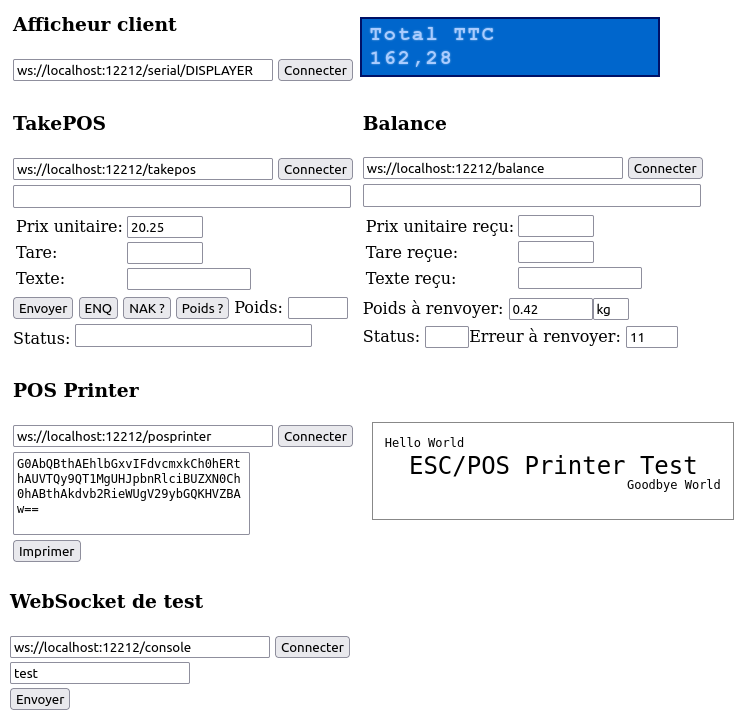

# Demo pages of Webapp-Hardware-Bridge

## Point Of Sale Cockpit 

[whb-console](../demo/whb-console.html)

### Usage:

- Webapp-Hardware-Bridge GUI or Server is running
- run command (on linux) like `socat -dddd pty,raw,echo=0 pty,raw,echo=0` to simulate serial ports needed and configure them in WHB. It creates two virtual serial ports /dev/pts/1 and /dev/pts/2 which are connected, setup them to /serial/DISPLAY and /serial/DISPLAYER to watch Customer Display changes requested by TakePOS
- escpos-tools project is available near webapp-hardware-bridge project (both projects are in the same directory) as Webapp-Hardware-Bridge runs `../escpos-tools/esc2html.php` command to convert Base64 stream from TakePOS in the format ESC-POS received on the websocket /posprinter to HTML page representing the printed receipt. The converted receipt is sent back to the /posprinter websocket.
- to simulate continuous weight transmission through serial port (like AWH-30 Weighing Scale), launch the command `watch -n 1 ./2kg13.sh /dev/pts/5` in demo directory (/dev/pts/5 depends on virtual serial port created by socat command)
- websockets /takepos and /balance are connected inside Webapp-Hardware-Bridge (hard coded in Server.java): every data received by /takepos is sent to /balance and vice versa. Useful to simulate various weighing scale protocols (for now only Dialog-06...).

**Once everything works with this "debug" version (1.0.dev), it is possible to move back to version 1.0.2 as there is no need of demo files nor /console, /takepos, /balance and /posprinter websockets in real-world use.**

### Content:

- Setup and virtual 2 lines customer display
- Setup and virtual TakePOS/Weighing Scale using Dialog-06 protocol
- Setup and virtual thermal printer using ESC-POS protocol from EPSON
- simple WebSocket console for various tests

## Printer

[printer-advanced](../demo/printer-advanced.html)

[printer-annotation](../demo/printer-annotation.html)

[printer-basic](../demo/printer-basic.html)

## Serial

[serial-basic](../demo/serial-basic.html)

[serial-weight](../demo/serial-weight.html)
